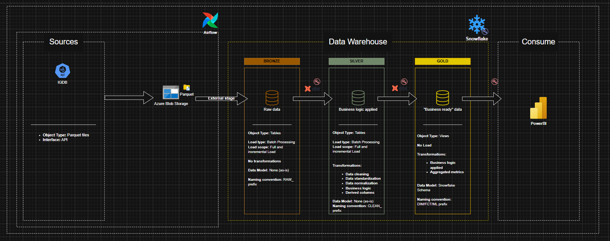

# Keeping up with games

Using data to stay up-to-date on video games!

## Business case

I haven't played video games for a while and I am out of touch with what games are considered cool and which upcoming releases are highly anticipated. Let's resolve this using the Internet Game DataBase (IGDB) data from Twitch!

To do so, the end goal should be to:
* Find insights into **what games are <u>currently</u> popular**.
* Have an overview of games that haven't released yet but are highly anticipated.

Explicit tasks:
* Set-up a data pipeline that fetches the required data from the IGDB API.
* Build a datamodel that can be leveraged for BI.
* Create a dashboard which provides insights on the current state of game trends.


## High-over project results

As of writing:
* Processed **~36,000 games** sourced from the IGDB API.
* Top wishlisted unreleased game: **The Elder Scrolls VI**.
* The game **GTA V** ranks highest in both Single and Multiplayer ratings across IGDB.
* Ratings stabilize at **500+ reviews**, making the 500–1K range the sweet spot for gauging true community consensus.
* Daily snapshots are available of game popularity across key metrics such as **Most Watched hours** on Twitch and **Peak CCU** (Concurrent Users).


## Prerequisites

* Docker + Docker Desktop
* Azure Account with sufficient permissions
* Snowflake account with sufficient permissions
* Power BI desktop
* IGDB API Client ID and Secret
* Terraform (optional)
* Azure CLI (recommended)

## Getting started
* [API setup](api_extract_data/README.md)
* [Azure setup](IaC/README.md)
* [Snowflake objects setup](sql/README.md)
* [dbt setup](dbt_transformation_layer/README.md)
* [Docker setup for Airflow](airflow_orchestration_layer/README.md)


## Pipeline up and running

After cloning this repo and following the guided setup steps for each component, running the pipeline is as simple as opening Docker desktop and running the following code in your terminal:

```powershell
cd .\airflow_orchestration_layer\
docker compose up -d
docker compose exec airflow-scheduler airflow dags trigger igdb_pipeline
```

To view the pipeline status, you can visit the Airflow UI on `http://localhost:8080/` (find the credentials in the container logs) or simply run the following in the terminal:

```powershell
docker compose exec airflow-scheduler airflow dags list-runs igdb_pipeline
```

and that's it! In a few minutes you will see that the tables in Snowflake will be populated and ready to be referenced by Power BI (make sure to refresh the data within the dashboard).


## Project methodology and reasoning

### Architecture
* An ELT approach was adopted to preserve raw source data integrity, with a clear Bronze → Silver → Gold layering, where Gold serves as the consumption layer.
* The raw data is being ingested into the datawarehouse following a TRUNCATE + COPY INTO pattern as the main usecase is to get an overview of the most recently available information.



### Pipeline Overview

```
Pipeline trigger
      ↓
Extract API
      ↓
Write data to Azure Blob Storage
      ↓
Load data into Snowflake Bronze layer (TRUNCATE & COPY INTO)
      ↓
dbt Transformations & Tests into Silver & Gold
```

### Tech Stack Rationale

**Core Tools**
* **Python** handles data ingestion from the IGDB API across multiple endpoints.
* **Azure Blob Storage** serves as the raw landing zone before data enters the warehouse. This adds a decoupling layer and raw data durability, at the cost of an extra hop before data reaches the warehouse.
* **Snowflake** serves as the cloud data warehouse for storage and compute.
* **dbt** manages all transformations within the Silver and Gold layers.
* **Airflow** orchestrates the end-to-end pipeline, from ingestion through to transformation.
* **Power BI** connects to the Gold layer for reporting and visualisation.

**Security**
* Sensitive credentials are stored in **Azure Key Vault**.
* Key-pair authentication is configured for the dbt and Power BI Snowflake service users.
* Referencing secrets during the local development is kept as close as possible to referncing it in production.

**Tradeoffs**
* **Airflow** is powerful for orchestration but adds infrastructure overhead; a lighter tool like Prefect could suffice for a pipeline of this scale.
* By ingesting the data into the datawarehouse using a TRUNCATE + COPY INTO pattern the data is always up-to-date, but this also means we cannot extract insights based on trends over time as there are no historical records to reference. By landing the data extracts into the Azure Blob Storage before ingesting it into Snowflake the information is still available if the scope of the business requirements expands beyond snapshots.


### What went wrong and learnings

#### Optimizing too early:
I really like incrementally loading my fact tables and wanted to implement this as well within the project. However, I noticed that the run time on dbt grew quite significantly, which is caused by the size of the dataset for this project; it is too small to truly benefit from the optimization that incremental load brings.

Since the *incremental_strategy='append'* could very easily append duplicate records with the current setup and although *incremental_strategy='merge'* resolves this issue, it would have to make a full source/destination table scan with minor to no upside to show for it.

Instead of optimizing too early by sacrificing transformation efficiency for a *'scalable'* load method, I made the concious choice of staying flexible in how to handle reducing transformation time in the future, which also aligns with the ingestion pattern. The benefit is that the transformation time was **reduced to a third** of when the incremental strategy was applied.

#### Windows file lock on dbt packages:
For some reason, Windows likes to throw the following error whenever I run `dbt deps`:  

```
PermissionError: [WinError 32] The process cannot access the file because it is being used by another process: 'dbt_packages\\dbt-utils-1.3.0'
```

This occurs as dbt is trying to download a temporary file of the package, essentially copying + renaming the temp file and deleting it afterwards, which fails.

As this only occurs within my local environment during development and not within the dbt docker container, I did not spend more time and effort on this bug than my initial troubleshooting. What worked for me was deleting the temporary file manually after confirming that the copied file has been created succesfully.

#### Referencing the dbt user private key:
I initially wanted to utilize the [Airflow cosmos library](https://github.com/astronomer/astronomer-cosmos), having an Airflow dag trigger the dbt commands for the transformations. The most straightforward way to do this would be by mounting the dbt project in the Docker volume. This raises the question on how to reference the private key that dbt needs to authenticatie to the Snowflake system user. Having finally figured out a way that satisfies my security standards, by pulling the Azure Secret that holds the private key contents and storing it in `/tmp/rsa_key.p8` within the container, I faced the following two additional problems:

* The private key must exist in every Airflow container that runs tasks.
* `dbt deps` requires permission workarounds due to Windows/Linux volume ownership conflicts.

 This introduces more risk in the form of additional points of failure than I am willing to accept within the context of this project. 

The next best alternative, which turned out to be a better option, is to have dbt run in its own dedicated Docker container, completely isolated from Airflow.

A dedicated dbt container solves both cleanly:

* Private key fetched at container startup via `entrypoint.sh` and is therefore never baked into the image, just stored in the temporary storage `/tmp/rsa_key.p8`, which is RAM-backed and cleared when the container exits.
* `dbt deps` runs at image build time, so no runtime workarounds needed.
* As an additional benefit, dbt and Airflow dependency environments are then fully isolated.


Airflow uses `DockerOperator` to spawn the dbt container per command, passing only
the Azure Service Principal credentials (which are already passed on via the .env file or when scaling via e.g. a Kubernetes deployment manifest) needed to reach Key Vault and the private key that dbt needs to authenticate to its Snowflake system user. Airflow never
touches the private key, it just sends a command to Docker and waits for the exit
code to determine task success or failure.